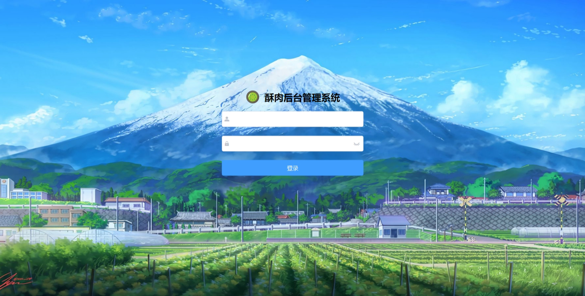
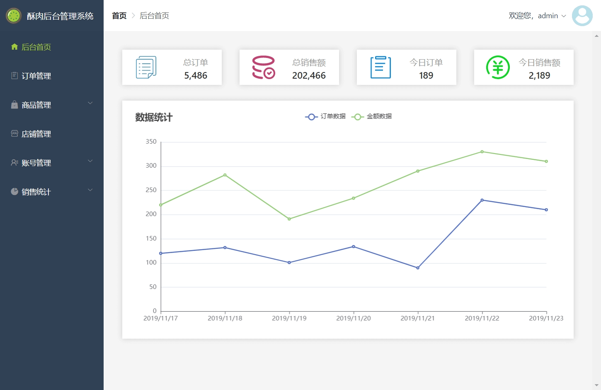
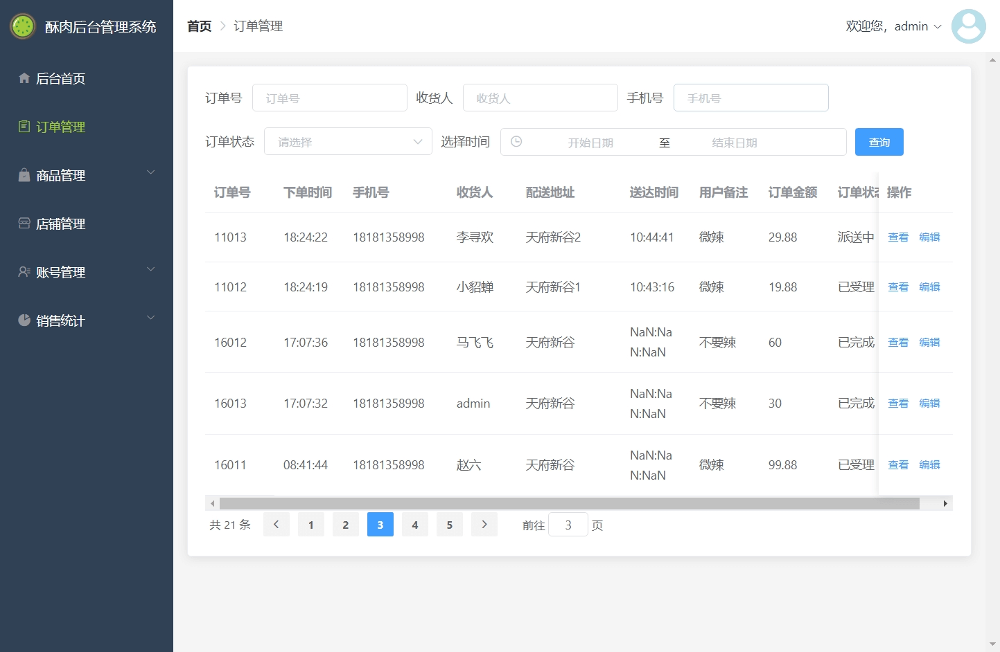
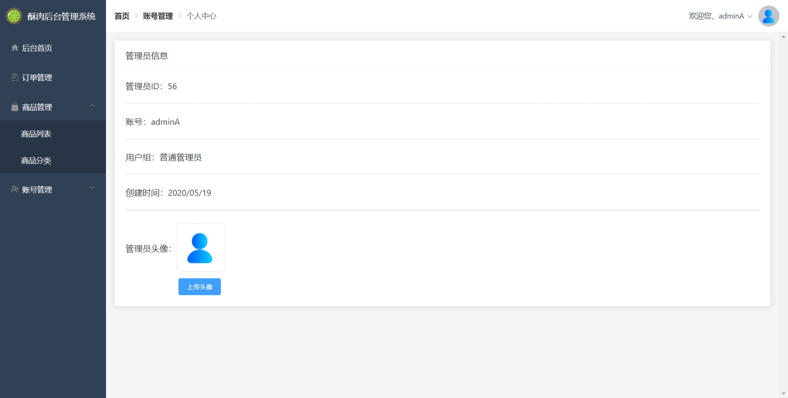

# sell-manage
学习用vue编写后台管理项目

## 项目介绍

`sell manage`是一个基于`Vue`和`Element`外卖后台管理系统的前端项目。

该项目主要用于**管理用户**、**商品信息**、**店铺信息**、**订单**、**数据统计**等业务。系统包括用户的登录与登出功能、用户管理模块、权限管理模块、店铺管理模块、商品管理模块、订单管理模块、数据统计模块等。不同的用户权限能渲染出不同的导航菜单，控制进入权限页面。

## 项目展示









## 技术开发

- Vue2.0 前端框架对页面组件化
- Vue-router 路由框架管理创建单页面应用
- Element 前端UI框架完成页面布局
- Axios 前端HTTP框架与后端接口联调，发送请求实现增删改查
- Echarts 图表框架对后台数据可视化
- Git 对开发仓库进行管理及同步。

## 项目布局

```
src -- 源码目录
├── api -- axios网络请求定义
├── assets -- 静态资源文件
├── components -- 通用组件封装
├── filters -- 全局过滤器
├── layout -- 通用页面加载框架
├── mixins -- 通用混合器封装
├── router -- vue-router路由配置
├── utils -- 工具类
└── views -- 前端页面
    ├── login -- 登录页
    ├── home -- 首页
    ├── order -- 订单模块页面
    ├── goods -- 商品模块页面
    ├── shop -- 店铺模块页面
    ├── account -- 账号模块页面
    ├── total -- 统计模块页面
    └── error404 -- 404页面
```

## 项目搭建

- 下载node并安装：https://nodejs.org/dist/v14.18.1/node-v14.18.1-x64.msi;
- 该项目为前后端分离项目，访问本地访问接口需搭建后台环境
- 克隆源代码到本地，使用Visual Studio Code打开，并完成编译;
- 在VS Code命令行中运行命令：`yarn`，下载相关依赖;
- 在VS Code命令行中运行命令：`yarn serve`，运行项目;
- 访问地址：[http://localhost:8080](http://localhost:8090/) 即可打开后台管理系统页面;
